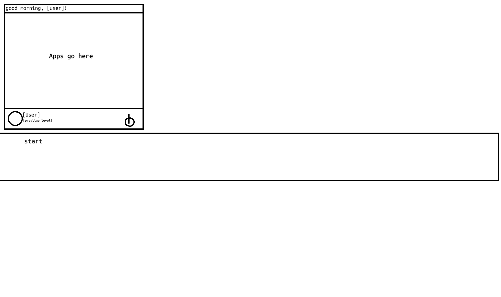

# AswdOS

A bare-metal hobby operating system for 32-bit x86 — written from scratch in C and assembly, with no external dependencies.

**Live demo:** [https://aswdbatch.github.io/Aswd-OS](https://aswdbatch.github.io/Aswd-OS)



---

## Features

- **GUI Desktop** — window manager with taskbar, start menu, desktop icons, drag/resize, up to 8 windows
- **15 Built-in Apps** — terminal, file manager, text editor, browser, calculator, notes, snake game, task manager, settings, OS info, app store, AX Studio IDE, AX Docs viewer, Work180 office suite, AX App Runner
- **FAT32 Filesystem** — full read/write with long filenames, directory support, soft-delete to recycle bin, move/copy (recursive)
- **TCP/IP Networking** — complete stack with DHCP, DNS, HTTP client; supports RTL8139, RTL8168, and e1000 NICs
- **WiFi** — WPA/WPA2-PSK with 5 backends: Intel 2200/3945, Atheros AR5k/AR9k, Broadcom BCM43xx, Realtek RTL8187
- **USB Host Stack** — UHCI (1.1), OHCI (1.1 stub), EHCI (2.0), xHCI (3.0 stub); HID keyboard/mouse support
- **Custom Scripting** — legacy `.aswd` scripts + the "Ax" interpreted language with variables, functions, file I/O, and network access
- **User Authentication** — graphical login with PIN entry, multi-user support, admin permissions
- **No libc, no malloc** — everything is freestanding with static buffers

---

## Quick Start

### Build (Windows)

```bat
build.bat
```

This produces `dist\aswd.iso` (for QEMU/VMs) and `dist\aswd-usb.img` (for real hardware).

### Run in QEMU

```bat
build.bat -run          # ISO with graphical display
build.bat -run-serial   # ISO with serial console output
build.bat -run-usb      # USB boot image
```

### Real Hardware

Flash `dist\aswd-usb.img` to a USB stick with **Rufus** in **DD Image mode**, then boot from it. Requires BIOS/CSM legacy mode — enable it in your firmware settings.

---

## Architecture

| Aspect | Detail |
|---|---|
| **Architecture** | i386 (32-bit protected mode, ring 0) |
| **Kernel base** | 1 MiB (`0x00100000`) |
| **Boot** | BIOS/CSM only (no UEFI) |
| **Graphics** | VESA framebuffer (VBE or Bochs BGA), backbuffer + dirty-rect present |
| **Toolchain** | i686-elf-gcc, NASM, freestanding (`-ffreestanding -nostdlib`) |

### Boot Chain

**ISO path:** GRUB → `kernel.elf` (multiboot) → `kernel_main()`

**USB path:** BIOS → MBR → VBR → Stage2 → `kernel-bios.bin` → `kernel_main()`

### Key Design Constraints

- **No heap** — all buffers are static and sized at compile time
- **No libc** — custom string/memory utilities in `src/lib/`
- **No virtual memory** — flat address space, everything shares ring 0

---

## Prerequisites

| Tool | Expected path | Source |
|---|---|---|
| GNU Make | `C:\tools\make.exe` | Chocolatey nupkg |
| NASM | `C:\NASM\nasm.exe` | [nasm.us](https://www.nasm.us/) |
| i686-elf-gcc | `C:\i686-elf-tools\bin\` | [lordmilko/i686-elf-tools](https://github.com/lordmilko/i686-elf-tools) |
| QEMU | `C:\Program Files\qemu\` | [qemu.org](https://www.qemu.org/download/) |
| Python 3.11 | on PATH | [python.org](https://python.org) |
| pycdlib | pip | `pip install pycdlib` |
| GRUB i386-pc modules | `C:\pkgs\grub-pc-bin-files\usr\lib\grub\i386-pc\` | Ubuntu `grub-pc-bin` .deb |

> BusyBox for Windows is also needed (`C:\tools\busybox.exe`) — grab it from [frippery.org](https://frippery.org/files/busybox/) and copy as `mkdir.exe`, `rm.exe`, `cp.exe`, `sh.exe`.

---

## Shell Commands

| Command | Description | Command | Description |
|---|---|---|---|
| `help` | List all commands | `df` | Show disk usage |
| `osinfo` | OS version info | `cd <path>` | Change directory |
| `sysinfo` | CPU/RAM info | `cat <file>` | Print file |
| `clear` | Clear screen | `write <file>` | Write to file |
| `echo <text>` | Print text | `rm <file>` | Delete (recycle bin) |
| `confirm <msg>` | Ask confirmation | `mkdir <dir>` | Create directory |
| `run <script>` | Run built-in script | `cp <src> <dst>` | Copy file/dir |
| `pwd` | Print working dir | `mv <src> <dst>` | Move file/dir |
| `ls` | List directory | `find <pattern>` | Search for files |
| `grep <pattern>` | Search contents | `history` | Command history |
| `ln <target> <link>` | Create link | `inspect` | Inspect filesystem |
| `test` | Run diagnostics | `compile` | Compile script |
| `logs` | Show boot logs | `power` | Shutdown/reboot |
| `ping <host>` | ICMP echo | `http <url>` | Fetch URL |
| `ax <file.ax>` | Run Ax script | `settings` | Open settings |
| `vfstest` | Test VFS | `bootlog` | Dump boot log |

### Confirmation Keywords

**YES:** `acknowledge`, `ack`, `yes`, `y`
**NO:** `veto`, `v`, `no`, `n`

---

## Directory Structure

```
src/
├── kernel.c          — OS entry point, subsystem orchestration
├── auth/             — Graphical login, PIN verification, session management
├── assets/           — Pre-rendered font and icon data (auto-generated)
├── boot/             — Boot entries (multiboot + BIOS), boot UI, GDT, multiboot parser
├── common/           — Config, colors, changelog, boot log, power (ACPI shutdown/reboot)
├── confirm/          — Text-mode yes/no confirmation prompts
├── console/          — Central text output (VGA ↔ winconsole redirection)
├── cpu/              — IDT, IRQ, PIC, timer, exception handling, bugcheck (BSOD)
├── crypto/           — AES-128, SHA-1, HMAC, PBKDF2, WPA PRF
├── diagnostics/      — Boot-time test runner (smoke, temp write, keyboard, force bugcheck)
├── drivers/          — VGA, VBE, BGA, ATA, disk, FAT32, PCI, PS/2, serial, font, icon, mouse, speaker, VT console
├── editor/           — TUI text editor core
├── explorer/         — Legacy TUI application hub
├── fs/               — Virtual filesystem layer over FAT32
├── gui/              — Window manager, theme engine, 15+ applications
├── input/            — Unified input abstraction (serial, keyboard, mouse)
├── lang/             — "Ax" interpreted language (lexer, parser, evaluator)
├── lib/              — Freestanding string/memory utilities (no libc)
├── net/              — Full TCP/IP stack + NIC drivers + WiFi + HTTP
├── script/           — Legacy .aswd scripting system
├── settings/         — TUI settings screen
├── shell/            — Interactive REPL + 30+ commands
├── tui/              — Text-mode UI primitives
├── usb/              — USB host stack (UHCI/OHCI/EHCI/xHCI) + HID
├── usbboot/          — Custom bootloader chain (MBR, VBR, stage2, trampoline)
└── users/            — User management (up to 8 users, admin)
```

---

## GUI Applications

| App | Description |
|---|---|
| **Terminal** | Embedded shell with line editing and 16-entry history |
| **Files** | File manager with sidebar, address bar, icon/name/size/date columns |
| **Editor** | Text editor with toolbar, line numbers, syntax-aware editing |
| **OS Info** | System details: version, CPU, RAM, storage, changelog, uptime |
| **Settings** | 5 tabs: Display, System, Devices, Users, Network |
| **Task Manager** | Lists windows, USB devices, sessions; can close windows |
| **Snake** | Snake game on 20×20 grid with scoring |
| **Notes** | Simple notepad with save/load |
| **App Store** | Browse and launch all installed apps |
| **Calculator** | Basic arithmetic with expression preview |
| **Browser** | HTTP browser with HTML rendering and history |
| **AX Docs** | Ax language documentation viewer |
| **AX Studio** | Visual IDE for building AX apps (design + logic wiring) |
| **AX App Runner** | Executes .ax visual app projects with multi-scene support |
| **Work180** | Office suite: documents, spreadsheets, presentations |

---

## Scripting

### Legacy .aswd Scripts

```aswd
set msg=Hello
echo $msg
confirm "Proceed?"
iflast ack
  sysinfo
```

### Ax Language (`.ax`)

```ax
let name = input("Your name: ")
print("Hello, " + name)

let x = 2 + 3 * 4
print(x)

fn greet(who) {
    return "Hello, " + who
}
```

Run with `ax <file.ax>` in the shell. See `AX_docs.md` for full documentation.

---

## Web Demo

The live demo at [aswdbatch.github.io/Aswd-OS](https://aswdbatch.github.io/Aswd-OS) runs entirely in the browser using [v86](https://github.com/copy/v86), a JavaScript x86 emulator. It works but is **not native speed** — expect slower boot times and response compared to QEMU or real hardware.

---

## License

This project is a personal hobby OS. No formal license is declared.
